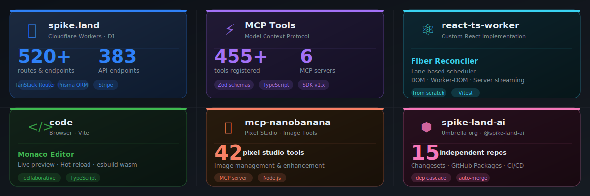
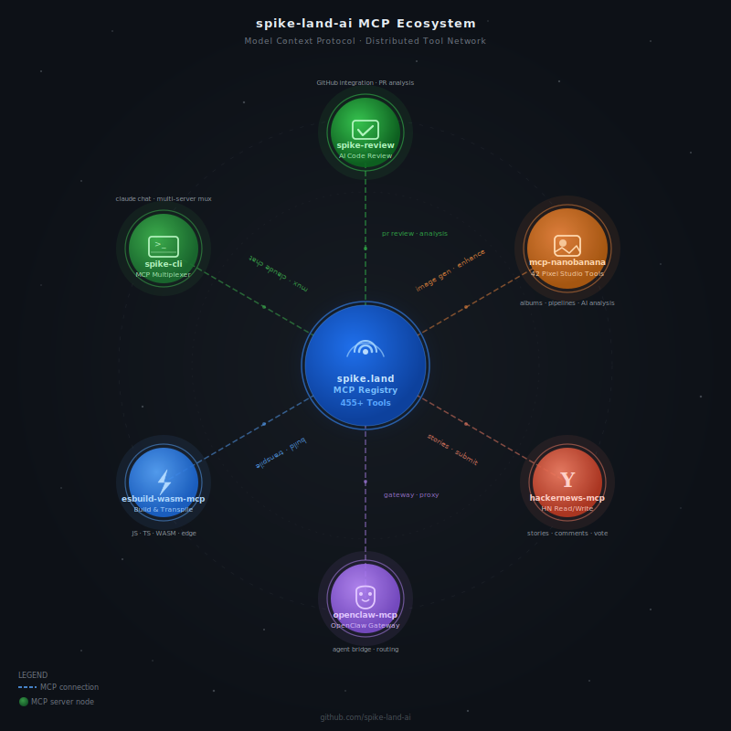
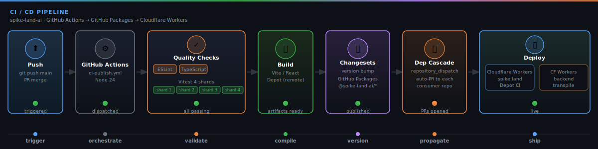
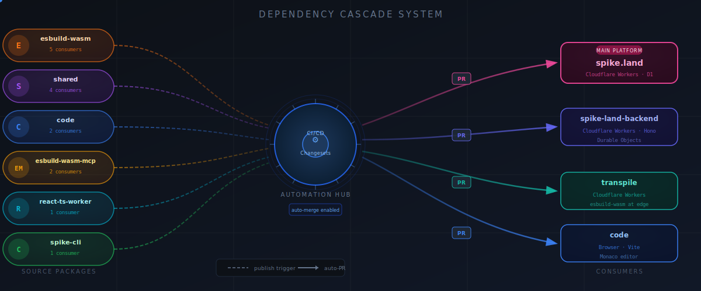

<p align="center">
  <a href="https://spike.land">
    
  </a>
</p>

<p align="center">

<!-- Runtimes -->


<!-- Frameworks -->
-61DAFB?style=for-the-badge&logo=react&logoColor=black)


<!-- AI/MCP -->


</p>

---

spike-land-ai is an AI-native development platform — a consolidated monorepo with 28 packages under `src/`. Powered by Cloudflare Workers + D1 as the data backbone, with a Vite + TanStack Router frontend, Hono edge services, and a growing MCP ecosystem of 80+ tools. It includes a from-scratch React Fiber implementation, edge transpilation workers, and spans browser, edge, and server runtimes, all published under `@spike-land-ai` on GitHub Packages with automated dependency cascade CI.

See [docs/](docs/README.md) for full documentation.

---

<p align="center">
  
</p>

## Architecture

<p align="center">
  
</p>

## MCP Ecosystem

<p align="center">
  
</p>

## Packages

### Platform Stack

| Package | Runtime | Description | Status |
|---------|---------|-------------|--------|
| [spike-app](src/frontend/platform-frontend) | Browser (Vite + TanStack Router) | **Frontend SPA**: Frontend with TanStack Router, Vite, and React. | [](https://github.com/spike-land-ai/spike-land-ai/actions) |
| [spike-edge](src/edge-api/main) | Cloudflare Workers | **Edge API**: Primary edge API service using Hono framework. | [](https://github.com/spike-land-ai/spike-land-ai/actions) |
| [spike-land-mcp](src/edge-api/spike-land) | CF Workers + D1 | **MCP Registry**: Tool registry with 80+ tools, D1-backed storage. | [](https://github.com/spike-land-ai/spike-land-ai/actions) |
| [mcp-auth](src/edge-api/auth) | Cloudflare Workers | **Auth Service**: Authentication MCP server using Better Auth + Drizzle. | [](https://github.com/spike-land-ai/spike-land-ai/actions) |
| [mcp-server-base](src/core/server-base) | Node.js | **MCP Utilities**: Shared base utilities for building MCP servers. | [](https://github.com/spike-land-ai/spike-land-ai/actions) |

### Domain Packages

| Package | Runtime | Description | Status |
|---------|---------|-------------|--------|
| [chess-engine](src/core/chess) | Node.js | **Chess Engine**: ELO rating engine with game, player, and challenge managers. | [](https://github.com/spike-land-ai/spike-land-ai/actions) |
| [qa-studio](src/core/browser-automation) | Node.js | **QA Automation**: Browser automation utilities built on Playwright. | [](https://github.com/spike-land-ai/spike-land-ai/actions) |
| [state-machine](src/core/statecharts) | Node.js | **Statecharts**: Statechart engine with guard parser and CLI. | [](https://github.com/spike-land-ai/spike-land-ai/actions) |

### Core Infrastructure

| Package | Runtime | Description | Status |
|---------|---------|-------------|--------|
| [code](src/frontend/monaco-editor) | Browser (Vite) | **Code Editor**: A real-time collaborative code editor based on Monaco. Supports TypeScript and live preview for rapid prototyping. | [](https://github.com/spike-land-ai/spike-land-ai/actions) |
| [spike-land-backend](src/edge-api/backend) | Cloudflare Workers | **Edge Backend**: Main API services using Hono and Cloudflare Durable Objects. Handles real-time synchronization and state management. | [](https://github.com/spike-land-ai/spike-land-ai/actions) |
| [transpile](src/edge-api/transpile) | Cloudflare Workers | **Edge Transpilation**: High-speed JavaScript/TypeScript compilation service using `esbuild-wasm` running on the edge. | [](https://github.com/spike-land-ai/spike-land-ai/actions) |
| [react-ts-worker](src/core/react-engine) | Browser / Workers | **Custom React**: A from-scratch React implementation featuring a Fiber reconciler, lane-based scheduling, and multi-target rendering. | [](https://github.com/spike-land-ai/spike-land-ai/actions) |
| [esbuild-wasm](src/mcp-tools/esbuild-wasm) | Browser (WASM) | **WASM Build**: Cross-platform esbuild WASM binary distribution. | [](https://github.com/spike-land-ai/spike-land-ai/actions) |
| [esbuild-wasm-mcp](src/mcp-tools/esbuild-wasm) | Node.js | **Build MCP**: MCP server that provides full control over the esbuild-wasm lifecycle for agents to perform builds. | [](https://github.com/spike-land-ai/spike-land-ai/actions) |
| [shared](src/core/shared-utils) | isomorphic | **Core Logic**: Shared TypeScript types, validation logic (Zod), constants, and common utilities used across all packages. | [](https://github.com/spike-land-ai/spike-land-ai/actions) |

### MCP Servers & Tools

| Package | Runtime | Description | Status |
|---------|---------|-------------|--------|
| [spike-cli](src/cli/spike-cli) | Node.js CLI | **Command Line Hub**: A multiplexer CLI that aggregates multiple MCP servers into a single endpoint with an interactive chat interface powered by Claude. | [](https://github.com/spike-land-ai/spike-land-ai/actions) |
| [mcp-image-studio](src/mcp-tools/image-studio) | Node.js | **Pixel Studio**: Advanced image management and enhancement MCP server. Provides ~42 tools for generation, upscaling, background removal, and album management. | [](https://github.com/spike-land-ai/spike-land-ai/actions) |
| [spike-review](src/mcp-tools/code-review) | Node.js | **Review Bot**: Branded AI code review assistant that enforces BAZDMEG quality gates across the entire org. | [](https://github.com/spike-land-ai/spike-land-ai/actions) |
| [hackernews-mcp](src/mcp-tools/hackernews) | Node.js | **HN Integration**: Specialized MCP server for reading and interacting with HackerNews. | [](https://github.com/spike-land-ai/spike-land-ai/actions) |
| [openclaw-mcp](src/mcp-tools/openclaw) | Node.js | **OpenClaw Bridge**: Standalone MCP bridge providing interoperability with the OpenClaw gateway. | [](https://github.com/spike-land-ai/spike-land-ai/actions) |
| [vibe-dev](src/cli/docker-dev) | Node.js CLI | **Vibe Workflow**: Docker-based development workflow optimizer for vibe-coded applications. | [](https://github.com/spike-land-ai/spike-land-ai/actions) |
| [video](src/media/educational-videos) | Remotion | **Programmatic Video**: Educational and promotional video assets built using React and Remotion. | [](https://github.com/spike-land-ai/spike-land-ai/actions) |

## Repository Deep Dive

### Platform Stack
- **spike-app**: Vite + React + TanStack Router frontend
- **spike-edge**: Primary edge API on Cloudflare Workers (Hono)
- **spike-land-mcp**: MCP registry with 80+ tools (CF Workers + D1)
- **mcp-auth**: Authentication service (Better Auth + Drizzle on CF Workers)

### AI & MCP Layer
We embrace the Model Context Protocol (MCP) as our primary integration interface. Repositories prefixed with `mcp-` or suffixed with `-mcp` provide specialized capabilities:
- **spike-land-mcp**: The tool registry (80+ tools).
- **mcp-image-studio**: The visual intelligence layer (Pixel Studio).
- **esbuild-wasm-mcp**: The builder layer.
- **hackernews-mcp**: Information retrieval layer.
- **mcp-server-base**: Shared utilities for building MCP servers.

### Infrastructure & Tooling
- **Dependency Cascade**: We use a custom automated system to propagate dependency updates across 28 packages, ensuring architectural consistency without manual toil.
- **Edge Computing**: We leverage Cloudflare Workers for ultra-low latency tasks like transpilation, MCP registry, auth, and real-time collaboration.
- **BAZDMEG Quality Gates**: Our automated review system (**spike-review**) ensures that every PR meets our rigorous engineering standards.


## Quick Start

All packages live under `src/`. Clone the repo and work from there:

```bash
git clone https://github.com/spike-land-ai/spike-land-ai
cd spike-land-ai

# Frontend SPA (Vite + TanStack Router)
cd src/spike-app
npm install
npm run dev

# Node.js / MCP servers (most packages)
cd src/<package>
npm install
npm run build
npm test

# Cloudflare Workers (spike-edge, spike-land-mcp, mcp-auth, spike-land-backend, transpile)
cd src/<worker>
npm install
npm run dev           # local wrangler
npm run dev:remote    # remote wrangler

# Monaco editor (code)
cd src/code
npm install
npm run dev:vite      # Vite dev server

# Custom React (react-ts-worker)
cd src/react-ts-worker
yarn install
yarn build
yarn test
```

Org-wide health check (PRs, CI status, dep drift):

```bash
make health
# or: bash .github/scripts/org-health.sh
```

## CI/CD Pipeline

<p align="center">
  
</p>

All packages share a reusable workflow at `.github/.github/workflows/ci-publish.yml` running on Node 24. Changesets manages versioning; packages publish to GitHub Packages on every merge to `main`.

## Dependency Cascade

<p align="center">
  
</p>

Publishing any `@spike-land-ai/*` package triggers automated PRs in downstream repos. The DAG is defined in `.github/dependency-map.json`. Check for drift locally:

```bash
bash .github/scripts/verify-deps.sh
```

| Source | Consumers |
|--------|-----------|
| `esbuild-wasm` | esbuild-wasm-mcp, code, transpile, spike-land-backend |
| `esbuild-wasm-mcp` | code, spike-land-backend |
| `code` | transpile, spike-land-backend |
| `shared` | mcp-image-studio, spike-land-mcp |
| `eslint-config` | chess-engine, code, esbuild-wasm-mcp, hackernews-mcp, mcp-image-studio, mcp-server-base, openclaw-mcp, react-ts-worker, shared, spike-app, spike-cli, spike-edge, spike-review, state-machine |
| `tsconfig` | chess-engine, code, esbuild-wasm-mcp, hackernews-mcp, mcp-image-studio, mcp-server-base, openclaw-mcp, react-ts-worker, shared, spike-cli, spike-review, state-machine |

## Development

```bash
# Node.js / MCP servers
npm run build         # Compile TypeScript
npm test              # Run Vitest tests
npm run test:coverage # Tests with coverage thresholds
npm run typecheck     # tsc --noEmit
npm run lint          # ESLint

# spike-app (Vite frontend)
npm run dev           # Vite dev server
npm run build         # Production build

# Cloudflare Workers
npm run dev           # Local wrangler dev
npm run w:deploy:prod # Deploy to production
```

## Contributing

- TypeScript strict mode is enforced across all packages — use `unknown` instead of `any`
- Tests are written with Vitest; coverage thresholds are enforced in CI (80%+ for most packages)
- Never use `eslint-disable`, `@ts-ignore`, or `@ts-nocheck`
- Version and publish via [Changesets](https://github.com/changesets/changesets) — do not manually bump `package.json` versions
- MCP servers follow the pattern: `@modelcontextprotocol/sdk` + Zod schema + tool handler + matching test file

## License

MIT
