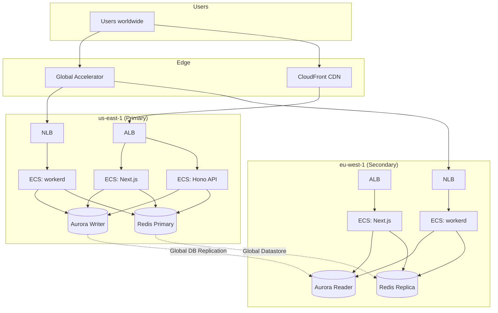

# AWS Migration Status

> Migration from **Vercel + Cloudflare Workers + Neon + Upstash + Cloudflare
> R2** → **AWS ECS Fargate + Aurora PostgreSQL + ElastiCache Redis + S3 +
> CloudFront + Global Accelerator**

Last updated: 2026-02-26

---

## Migration Progress Overview

| Component                | From                | To                           | Status         |
| ------------------------ | ------------------- | ---------------------------- | -------------- |
| **Next.js Hosting**      | Vercel              | ECS Fargate (Docker)         | ✅ Done        |
| **Workers Runtime**      | Cloudflare Workers  | ECS Fargate (workerd Docker) | ✅ Done        |
| **Hono MCP API**         | (new service)       | ECS Fargate (Docker)         | ✅ Done        |
| **Database**             | Neon PostgreSQL     | Aurora PostgreSQL (Global)   | 🟡 Infra ready |
| **Cache / Rate-Limit**   | Upstash Redis       | ElastiCache Redis (Global)   | 🟡 Infra ready |
| **Object Storage**       | Cloudflare R2       | S3                           | � Code ready   |
| **CDN**                  | Vercel Edge / CF    | CloudFront                   | 🟡 Infra ready |
| **Global Routing**       | Vercel Edge         | AWS Global Accelerator       | 🟡 Infra ready |
| **IAM / Auth (CI)**      | Tokens              | OIDC (GitHub → AWS)          | ✅ Done        |
| **IaC**                  | —                   | Terraform (7 modules)        | ✅ Done        |
| **CI Pipeline**          | GH Actions + Vercel | GH Actions + Docker + ECS    | ✅ Done        |
| **Staging Deploy**       | Vercel              | ECS (staging cluster)        | 🟡 Dual-mode   |
| **Production Deploy**    | Vercel              | ECS (multi-region)           | 🟡 Dual-mode   |
| **Rollback**             | Vercel CLI          | ECS task definition rollback | ✅ Done        |
| **DB Backup**            | Cloudflare R2       | S3                           | ✅ Done        |
| **DB Staging Reset**     | Neon branching      | Aurora clone / snapshot      | ✅ Done        |
| **DB Migrations**        | GH Actions + Neon   | GH Actions + Aurora          | ✅ Done        |
| **Domain DNS**           | Vercel / Cloudflare | Route 53 / CloudFront        | 🔴 Not started |
| **Monitoring / Logging** | Vercel Analytics    | CloudWatch / X-Ray           | 🔴 Not started |
| **Secrets Management**   | GH Secrets / .env   | AWS Secrets Manager / SSM    | 🔴 Not started |

**Legend:** ✅ Done · 🟡 Partially done / infra ready · 🔴 Not started / still
legacy

---

## What's Been Built (✅ Completed)

### 1. Docker Containerization

All three services are containerized with production-ready multi-stage
Dockerfiles:

| Image                 | Dockerfile                                                                    | Base    | Port |
| --------------------- | ----------------------------------------------------------------------------- | ------- | ---- |
| `spike-land-nextjs`   | [Dockerfile](file:///Users/z/Developer/spike-land-ai/spike.land/Dockerfile)          | Node 24 | 3000 |
| `spike-land-workerd`  | [Dockerfile](file:///Users/z/Developer/spike-land-ai/spike.land/workers/Dockerfile)  | Node 22 | 8080 |
| `spike-land-hono-api` | [Dockerfile](file:///Users/z/Developer/spike-land-ai/spike.land/hono-api/Dockerfile) | Node 24 | 3000 |

The root Dockerfile also includes stages for `dev`, `lint`, `tsc`, `unit-tests`
(4 shards), and `ci` — see
[docker-bake.hcl](file:///Users/z/Developer/spike-land-ai/spike.land/docker-bake.hcl).

Local dev:
[docker-compose.yml](file:///Users/z/Developer/spike-land-ai/spike.land/docker-compose.yml)
with LocalStack (S3 + DynamoDB), Redis, and PostgreSQL.

### 2. Terraform Infrastructure-as-Code

```
infra/terraform/
├── environments/
│   ├── staging/           # Single-region (us-east-1), smaller instances
│   ├── production/        # Multi-region (us-east-1 + eu-west-1), full HA
│   └── production-v1/     # Previous production config (kept for reference)
└── modules/
    ├── vpc/               # VPC with public/private subnets, NAT GW
    ├── ecs/               # ECS Fargate cluster, services, ALB, NLB, SGs
    ├── aurora/            # Aurora PostgreSQL (optional Global Database)
    ├── elasticache/       # ElastiCache Redis (optional Global Datastore)
    ├── cloudfront/        # CloudFront distribution
    ├── global-accelerator/# AWS Global Accelerator
    └── cron/              # Scheduled tasks
```

**State backend:** S3 bucket `spike-land-terraform-state` with DynamoDB locks.

**Staging config:**

- VPC CIDR `10.10.0.0/16`, 3 AZs
- ECS: workerd (256 CPU / 512 MiB), Next.js (512 CPU / 1GiB)
- Aurora: single `db.t4g.medium` instance, no global cluster
- ElastiCache: `cache.t4g.medium`, no global datastore
- CloudFront, no Global Accelerator

**Production config:**

- **us-east-1** (primary): VPC `10.0.0.0/16`, Next.js (1024 CPU / 2GiB), Aurora
  `db.r6g.large` × 2, Redis `cache.r6g.large` × 2
- **eu-west-1** (secondary): VPC `10.1.0.0/16`, same services, Aurora reader ×
  1, Redis × 1
- Aurora Global Database, ElastiCache Global Datastore, Global Accelerator with
  NLB endpoints

### 3. GitHub Actions CI/CD Pipelines

| Workflow                                                                                                 | Trigger                     | Function                                                                                           |
| -------------------------------------------------------------------------------------------------------- | --------------------------- | -------------------------------------------------------------------------------------------------- |
| [deploy.yml](file:///Users/z/Developer/spike-land-ai/spike.land/.github/workflows/deploy.yml)                   | push main / PR / manual     | **Main deploy**: build → ECS deploy → smoke tests (staging for PRs, production+secondary for main) |
| [deploy-aws.yml](file:///Users/z/Developer/spike-land-ai/spike.land/.github/workflows/deploy-aws.yml)           | push main (workers/src)     | Earlier version of multi-region ECS deploy                                                         |
| [deploy-hono-api.yml](file:///Users/z/Developer/spike-land-ai/spike.land/.github/workflows/deploy-hono-api.yml) | push main (hono-api)        | Hono MCP API: test → build → staging → production                                                  |
| [terraform-plan.yml](file:///Users/z/Developer/spike-land-ai/spike.land/.github/workflows/terraform-plan.yml)   | PR (infra/terraform)        | `terraform plan` on PRs, posts diff to PR                                                          |
| [terraform-apply.yml](file:///Users/z/Developer/spike-land-ai/spike.land/.github/workflows/terraform-apply.yml) | push main (infra/terraform) | `terraform apply` to staging (auto) + production (manual)                                          |

### 4. OIDC Authentication

GitHub Actions authenticate to AWS via OIDC (no long-lived credentials):

| Secret                   | Purpose                                          |
| ------------------------ | ------------------------------------------------ |
| `AWS_DEPLOY_ROLE_ARN`    | Used by deploy workflows for ECR + ECS access    |
| `AWS_TERRAFORM_ROLE_ARN` | Used by Terraform workflows for infra management |
| `AWS_ROLE_ARN`           | Used by Hono API deploy workflow                 |
| `ECR_REGISTRY_PRIMARY`   | ECR registry URL for us-east-1                   |
| `ECR_REGISTRY_SECONDARY` | ECR registry URL for eu-west-1                   |
| `AWS_DEPLOY_ROLE_ARN_EU` | Deploy role for eu-west-1 secondary region       |
| `GLOBAL_ACCELERATOR_DNS` | Global Accelerator DNS for smoke tests           |

---

## What Still Needs Migration (🔴 / 🟡)

### Phase 1: Eliminate Dual-Mode CI (High Priority)

The CI/CD currently runs **both** Vercel and ECS pipelines:

- [ci-cd.yml](file:///Users/z/Developer/spike-land-ai/spike.land/.github/workflows/ci-cd.yml)
  deploys to **Vercel** staging (`next.spike.land`) after tests pass
- [deploy.yml](file:///Users/z/Developer/spike-land-ai/spike.land/.github/workflows/deploy.yml)
  deploys to **ECS** staging/production

**To do:**

- [ ] Decide on cutover date — when to stop deploying to Vercel
- [ ] Update `ci-cd.yml` to remove `deploy-staging` job (Vercel) or redirect to
      ECS
- [ ] Update DNS to point `spike.land` and `next.spike.land` to CloudFront /
      Global Accelerator
- [ ] Decommission Vercel project after DNS cutover is verified

### Phase 2: Update Legacy Workflows ✅ DONE

All legacy workflows have been migrated to AWS (verified 2026-02-17):

#### Rollback ([rollback.yml](file:///Users/z/Developer/spike-land-ai/spike.land/.github/workflows/rollback.yml)) ✅

- [x] Implement ECS rollback by reverting to previous task definition revision
- [x] Add `aws ecs update-service --task-definition <previous-revision>` logic
- [x] Keep smoke test verification steps

#### Database Backup ([backup.yml](file:///Users/z/Developer/spike-land-ai/spike.land/.github/workflows/backup.yml)) ✅

- [x] Switch storage target to S3 (OIDC auth, `spike-land-backups` bucket)
- [x] Update secrets: uses `AWS_DEPLOY_ROLE_ARN` via OIDC
- [x] Retention: auto-deletes backups older than 30 days

#### Staging DB Reset ([staging-reset.yml](file:///Users/z/Developer/spike-land-ai/spike.land/.github/workflows/staging-reset.yml)) ✅

- [x] Replace with Aurora clone or snapshot restore
- [x] Uses `aws rds restore-db-cluster-from-snapshot` with Aurora PostgreSQL
- [x] Snapshots production cluster, deletes staging, restores from snapshot

#### Database Migrations ([db-migrate.yml](file:///Users/z/Developer/spike-land-ai/spike.land/.github/workflows/db-migrate.yml)) ✅

- [x] Runs `prisma migrate deploy` against Aurora PostgreSQL
- [x] OIDC auth via `AWS_DEPLOY_ROLE_ARN`
- [x] Includes health check verification after migration

### EC2 Provisioning (Added February 2026)

The platform now supports EC2 instance provisioning for the Box system (virtual
browser instances). This runs alongside the ECS Fargate deployment.

**Key Components**:

- **Box model**: Extended with `ec2InstanceId`, `ec2Region`, `privateIp`,
  `publicIp`, and `tunnelUrl` fields for EC2 tracking
- **BoxTier model**: Pricing tiers for boxes (e.g., different instance sizes)
- **EC2 Provisioner** (`src/lib/boxes/ec2-provisioner.ts`): Manages the full
  lifecycle of EC2 instances per box, including creation, Cloudflare Tunnel
  setup, and polling for instance readiness
- **User Data Template** (`src/lib/boxes/user-data-template.ts`): Generates
  EC2 user data scripts for instance bootstrap
- **VNC Sessions** (`src/app/api/boxes/[id]/vnc-session/route.ts`): Issues
  short-lived JWTs (5-minute expiry) for VNC access via HTTPS tunnels
- **Sync Cron** (`src/app/api/cron/sync-box-status/route.ts`): Periodic cron
  job that synchronizes Box records with actual EC2 instance state. Protected
  by `validateCronSecret()` (timing-safe comparison)
- **Box Actions** (`src/app/api/boxes/[id]/action/route.ts`): REST endpoint
  for box lifecycle actions (start, stop, terminate)

**AWS Requirements**:

| Resource              | Purpose                                    |
| --------------------- | ------------------------------------------ |
| `@aws-sdk/client-ec2` | EC2 instance management                    |
| EC2 instances         | Box compute (on-demand, per user request)  |
| Cloudflare Tunnel     | Secure access to box VNC without public IP |

### Phase 3: Object Storage Migration

Cloudflare R2 → S3:

- [x] Audit all R2 usage (backups, file storage, code editor assets)
- [x] Refactor `r2-client.ts` and `audio-r2-client.ts` to support S3 via env
      vars (S3_* first, R2 fallback)
- [x] Add S3 env vars to `env.d.ts` type declarations
- [x] Update MCP tool descriptions from R2 → object storage
- [ ] Create S3 buckets via Terraform (add to modules)
- [ ] Set S3_* env vars in ECS task definitions
- [ ] Migrate existing R2 data to S3
- [ ] Update `docker-compose.yml` LocalStack config if needed

### Phase 4: App Code Updates

- [ ] Update `src/lib/upstash/` to support ElastiCache Redis (native Redis
      client vs Upstash REST API)
- [ ] If Upstash REST API layer is still desired, ensure the Redis REST proxy
      from `docker-compose.yml` is production-ready, or switch to native
      `ioredis`
- [ ] Update any hardcoded `testing.spike.land` references to
      `workerd.spike.land` or ECS service discovery
- [ ] Verify `TESTING_SPIKE_LAND_URL` env var is set correctly in ECS task
      definitions

### Phase 5: Observability & Operations

- [ ] Set up CloudWatch log groups for ECS services
- [ ] Configure CloudWatch alarms (CPU, memory, 5xx rate, latency)
- [ ] Set up AWS X-Ray for distributed tracing
- [ ] Migrate from Vercel Analytics to CloudWatch RUM or a third-party (PostHog,
      etc.)
- [ ] Set up AWS Secrets Manager or SSM Parameter Store for secrets (instead of
      env vars in task definitions)

### Phase 6: DNS Cutover

- [ ] Set up Route 53 hosted zone for `spike.land`
- [ ] Create CloudFront CNAME record for `spike.land`
- [ ] Create records for `workerd.spike.land`, `staging.spike.land`,
      `staging-workerd.spike.land`, `api.spike.land`, `staging-api.spike.land`
- [ ] Plan TTL lowering → cutover → verification → TTL restoration
- [ ] Remove Vercel / Cloudflare DNS records after verification period

---

## Architecture Diagram (Target State)



---

## Key Files Reference

| Category        | Files                                                                                                                                 |
| --------------- | ------------------------------------------------------------------------------------------------------------------------------------- |
| **Dockerfiles** | `Dockerfile`, `workers/Dockerfile`, `hono-api/Dockerfile`                                                                             |
| **Compose**     | `docker-compose.yml`, `docker-bake.hcl`                                                                                               |
| **Terraform**   | `infra/terraform/environments/*/main.tf`, `infra/terraform/modules/*/`                                                                |
| **Deploy CI**   | `.github/workflows/deploy.yml`, `deploy-aws.yml`, `deploy-hono-api.yml`                                                               |
| **Infra CI**    | `.github/workflows/terraform-plan.yml`, `terraform-apply.yml`                                                                         |
| **Legacy CI**   | `.github/workflows/ci-cd.yml` (Vercel — still active), `rollback.yml` (✅ ECS), `backup.yml` (✅ S3), `staging-reset.yml` (✅ Aurora) |

---

## How to Continue

### Immediate Next Steps

1. **Verify AWS infra is provisioned:** Run `terraform plan` in staging to
   confirm state is current
2. **Test the ECS deploy pipeline:** Push a test change and verify `deploy.yml`
   succeeds end-to-end
3. **Point DNS:** Once ECS deploys are stable, cut DNS from Vercel/Cloudflare to
   CloudFront + Global Accelerator
4. **Update `DATABASE_URL`:** Point staging and production to Aurora endpoints

### Recommended Order

```
Phase 0 (fix secrets) → Phase 1 (CI cutover) → Phase 6 (DNS)
      ↳ Phase 4 (app code: Redis client, URL refs)
            ↳ Phase 3 (storage: R2 → S3)
                  ↳ Phase 5 (observability)
```

Phase 2 (legacy workflows) is ✅ DONE.

> [!IMPORTANT]
> Until DNS is cut over, the site is still served by Vercel. The ECS
> infrastructure is built but not receiving production traffic yet.

---

## Verification Log (2026-02-17)

### Phase 1 Verification: Infrastructure & Deploy Pipeline

**Docker Builds: ✅ PASS**

- Both `spike-land-nextjs` and `spike-land-workerd` images build and push to ECR
- `deploy.yml` build jobs (Build Next.js image, Build workerd image) succeed
- OIDC auth via `AWS_DEPLOY_ROLE_ARN` works for ECR push

**Terraform Workflows: ❌ BLOCKED — Missing Secret**

- `terraform-plan.yml` and `terraform-apply.yml` both fail at AWS credential
  step
- Error:
  `Credentials could not be loaded, please check your action inputs: Could not load credentials from any providers`
- Root cause: `AWS_TERRAFORM_ROLE_ARN` secret is **not configured** in GitHub
- Until this secret is set, no infrastructure can be provisioned

**ECS Deploy: ❌ BLOCKED — No Infrastructure**

- `deploy.yml` deploy jobs fail at "Download current workerd task definition"
- Error: `Unable to describe task definition` — task definition
  `production-workerd` doesn't exist
- Root cause: Terraform hasn't been applied, so no ECS clusters/services/task
  definitions exist

**Staging Endpoints: ❌ NOT TESTED — Deploy hasn't succeeded**

### Missing GitHub Secrets

| Secret                   | Required By                             | Status                            |
| ------------------------ | --------------------------------------- | --------------------------------- |
| `AWS_ACCOUNT_ID`         | deploy.yml                              | ✅ Exists                         |
| `AWS_DEPLOY_ROLE_ARN`    | deploy.yml, backup.yml, db-migrate.yml  | ✅ Exists                         |
| `AWS_TERRAFORM_ROLE_ARN` | terraform-plan.yml, terraform-apply.yml | ❌ **MISSING** (critical blocker) |
| `ECR_REGISTRY_PRIMARY`   | deploy-aws.yml                          | ❌ MISSING                        |
| `ECR_REGISTRY_SECONDARY` | deploy-aws.yml                          | ❌ MISSING                        |
| `AWS_DEPLOY_ROLE_ARN_EU` | eu-west-1 deployment                    | ❌ MISSING                        |
| `GLOBAL_ACCELERATOR_DNS` | smoke tests                             | ❌ MISSING                        |

### Action Required

1. **Create IAM role for Terraform** with OIDC trust policy for GitHub Actions
2. **Set `AWS_TERRAFORM_ROLE_ARN`** secret in GitHub → unblocks
   `terraform-plan.yml` and `terraform-apply.yml`
3. **Run `terraform apply` for staging** → provisions ECS clusters, services,
   ALBs, Aurora, ElastiCache
4. **Re-run `deploy.yml`** → task definitions now exist, deploy should succeed
5. **Set remaining secrets** (`ECR_REGISTRY_*`, `AWS_DEPLOY_ROLE_ARN_EU`,
   `GLOBAL_ACCELERATOR_DNS`) for full multi-region support
